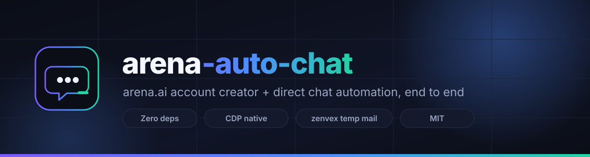

<div align="center">


# arena-auto-chat

**End-to-end arena.ai account creator and direct-chat automation.**
Fresh disposable inbox, magic-link verification, password setup, and a real chat with a frontier model — in one command.

<br>

[](https://nodejs.org)
[](#-zero-dependencies)
[](#-how-it-works)
[](https://arena.ai)
[](LICENSE)
[](#-requirements)
[](CONTRIBUTING.md)
[-7C8EA0?style=flat-square)](#-philosophy)

<br>

[English](README.md) · [Bahasa Indonesia](docs/readme/README.id.md) · [Español](docs/readme/README.es.md) · [简体中文](docs/readme/README.zh-CN.md) · [日本語](docs/readme/README.ja.md)

</div>

---

<p align="center">
  
</p>

## ✨ What it does

`arena-auto-chat` drives the real [arena.ai](https://arena.ai) web client. For
one account it:

1. 🎲 Generates a random identity — email local-part, strong password, full name.
2. 📧 Opens a fresh [zenvex.dev](https://zenvex.dev) disposable inbox.
3. ✍️ Submits the address to arena.ai's sign-up modal.
4. 🔗 Reads the magic verification link from the inbox and follows it.
5. 🔐 Sets a password and confirms the session is live.
6. 💬 Opens a **direct chat** with a chosen model and exchanges messages.

Everything is scripted end to end and ready to run on a VPS.

> **Result per account:** the email, the password, and a working arena.ai
> session — written to a local JSON file.

## 🚀 Quick start

```bash
git clone https://github.com/0xgetz/arena-auto-chat.git
cd arena-auto-chat

# Create one account, then send a test message to a model
node src/index.mjs run -m deepseek-v4.1-flash-max -p "test"
```

No `npm install`. No build step. Node 22 and a Chrome/Chromium binary is all you
need.

## 🧩 Requirements

- **Node.js ≥ 22** — for the native `WebSocket` global used by the CDP client.
- **Google Chrome or Chromium** — auto-detected, or set `CHROME_PATH`.
- Network access to `arena.ai` and `zenvex.dev`.

## 📖 Usage

### Commands

```bash
node src/index.mjs run      # create an account, then chat   (default)
node src/index.mjs create   # create an account only
node src/index.mjs chat     # chat on the existing login
```

### Examples

```bash
# Create an account and send a prompt
node src/index.mjs run -m deepseek-v4.1-flash-max -p "test"

# Create three accounts, 45s apart, into one file
./examples/run_batch.sh 3 45

# Chat on the browser profile's existing arena.ai login
node src/index.mjs chat -m gpt-5 -p "write a haiku about rain"

# Drive a Chrome you already have open on port 9222
node src/index.mjs run --cdp http://127.0.0.1:9222

# Watch it happen
node src/index.mjs run --headful
```

### Options

| Flag | Default | Description |
| --- | --- | --- |
| `-n, --count N` | `1` | Number of accounts to create. |
| `-d, --domain D` | random | Pin a zenvex receiving domain. |
| `-m, --model M` | `deepseek-v4.1-flash-max` | Model slug for the direct chat. |
| `-p, --prompt TEXT` | `test` | Message to send. |
| `-o, --out FILE` | `outputs/arena-accounts-<ts>.json` | Account JSON output. |
| `--cdp URL` | — | Attach to a running browser (`ws://` or `http://`). |
| `-t, --timeout MS` | `180000` | Verification-email timeout. |
| `--headful` | off | Show the browser window. |
| `-q, --quiet` | off | Print only the final summary. |
| `-h, --help` · `-v, --version` | — | Help · version. |

## 🔧 How it works

```
CLI
 └─ BrowserManager / RemoteBrowser      launch Chromium or attach over CDP
     ├─ zenvex.dev      → generate a disposable address, open its inbox
     ├─ arena.ai        → submit the address, read the magic link
     ├─ inbox           → follow the link, set a password, confirm login
     └─ arena.ai        → open direct chat, type, send, read the reply
```

- **`src/browser/cdp.mjs`** — a ~180-line Chrome DevTools Protocol client over
  Node's native `WebSocket`. Commands are multiplexed, responses correlated by
  `id`, events subscribable.
- **`src/arena/dom.mjs`** — every arena.ai selector and in-page script. A UI
  change on arena.ai is normally a one-file fix.
- **`src/arena/client.mjs`** — the signup, magic-link and chat flows.
- **`src/inbox/zenvex.mjs`** — disposable address generation and inbox reading.
- **`src/core/provision.mjs`** — orchestrates one account, start to finish.

Read [docs/ARCHITECTURE.md](docs/ARCHITECTURE.md) for the full design and
[docs/USAGE.md](docs/USAGE.md) for configuration and troubleshooting.

## 🪶 Zero dependencies

Node 22 ships `fetch` and `WebSocket`, which is everything a CDP client needs.
Skipping Puppeteer/Playwright means:

- `git clone` to running in seconds — nothing to install,
- no transitive dependency tree to audit,
- the browser connection is explicit instead of hidden behind a framework.

## 🔌 Attaching to an existing browser

```bash
# Desktop Chrome started with --remote-debugging-port=9222
node src/index.mjs run --cdp http://127.0.0.1:9222

# A hosted browser, given its WebSocket URL
node src/index.mjs run --cdp wss://host/devtools/browser/<id>
```

A bare hostname is assumed to be `https://`. This is the fastest way to iterate
and the easiest way to run against a browser with a different exit IP.

## 📦 Output

`outputs/arena-accounts-<timestamp>.json`:

```json
[
  {
    "ok": true,
    "provider": "arena.ai",
    "email": "swiftfox482913@souss.dev",
    "password": "K7!mQ2pXz9wRt4vB",
    "full_name": "Putri Maharani",
    "email_provider": "zenvex.dev (souss.dev)",
    "login_url": "https://arena.ai/",
    "elapsed_ms": 41230,
    "created_at": "2026-10-01T16:12:48.031Z"
  }
]
```

## ✅ End-to-end test

```bash
node src/test_e2e.mjs --cdp http://127.0.0.1:9222
```

Runs every stage against the live services and writes
`outputs/e2e-report-<ts>.json`. Exit code 0 means all stages passed.

## ⚙️ Configuration

Copy `.env.example` to `.env`. Flags win over environment variables, which win
over the file.

| Variable | Default | Description |
| --- | --- | --- |
| `CHROME_PATH` | auto | Chrome/Chromium executable. |
| `HEADLESS` | `1` | Run without a visible window. |
| `CDP_URL` | — | Attach to a running browser instead of launching. |
| `BROWSER_PROXY` | — | Proxy for the browser only, e.g. `socks5://127.0.0.1:10808`. |
| `PROFILE_DIR` | temp | Persistent profile; keeps logins between runs. |
| `EMAIL_TIMEOUT` | `180000` | ms to wait for the verification email. |
| `REPLY_TIMEOUT` | `180000` | ms to wait for a chat reply. |
| `ZENVEX_DOMAIN` | random | Pin the zenvex receiving domain. |
| `ARENA_MODEL` | `deepseek-v4.1-flash-max` | Default chat model. |
| `ARENA_PROMPT` | `test` | Default chat prompt. |

## 🧠 Philosophy

- **Zero dependencies.** Node 22 already has everything; a browser framework
  would be the largest thing in the repo.
- **Small, honest modules.** One responsibility per file, no hidden magic.
- **Selectors in one place.** arena.ai changes; `dom.mjs` is the blast radius.
- **No CI, by design.** The pipeline talks to live third-party sites with rate
  limits and anti-bot gates. A green check on every push would be noise; run
  `src/test_e2e.mjs` deliberately instead.

## ⚠️ Disclaimer

This project is for learning and technical research only. You are responsible
for complying with arena.ai's and zenvex.dev's terms of service and with local
law. Never commit or publish account credentials.

## 📄 License

[MIT](LICENSE)
